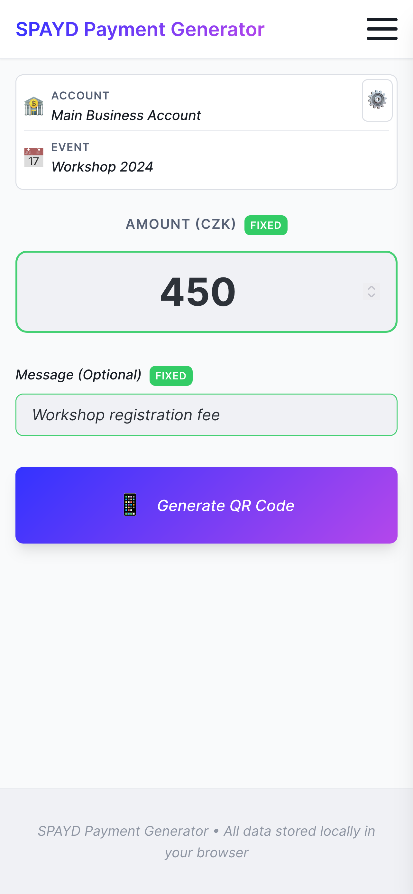
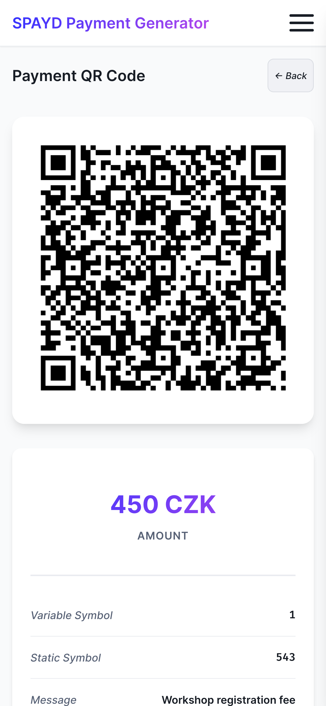
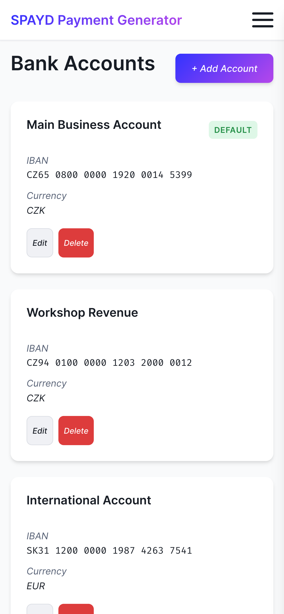
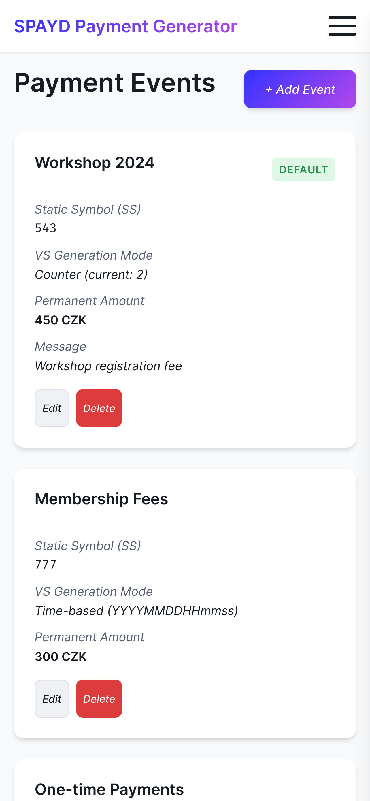
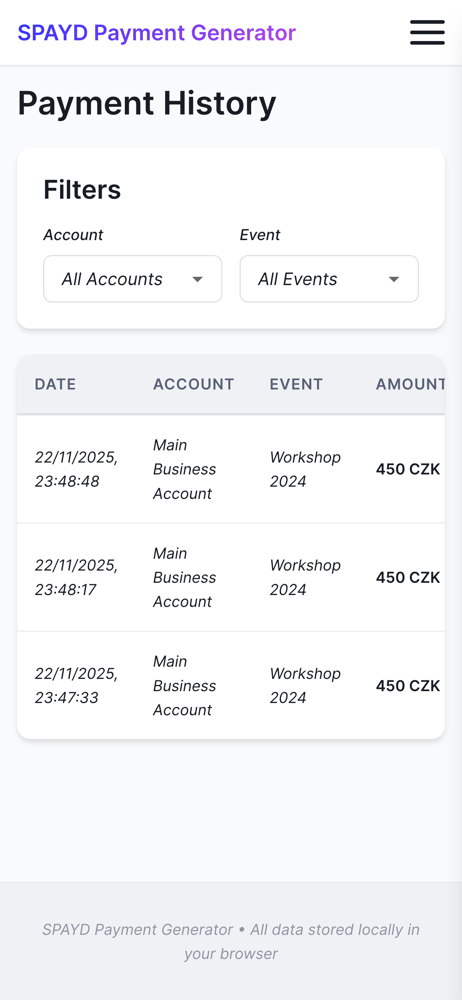
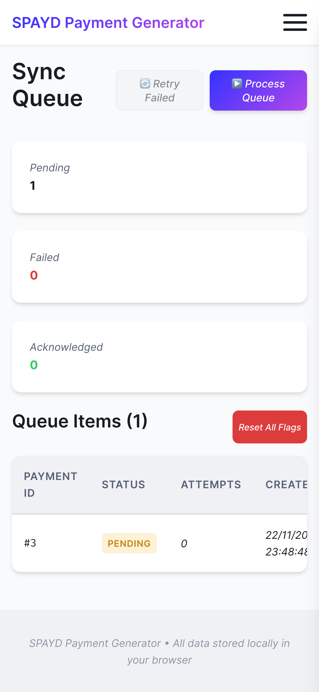
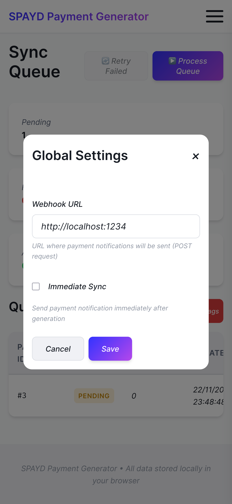

# User Guide - SPAYD Applied

Complete guide for using the SPAYD Applied suite of applications.

## Table of Contents

1. [SPAYD QR Generator](#spayd-qr-generator)
2. [Batch Payment Processor](#batch-payment-processor)
3. [FioFetch Transaction Manager](#fiofetch-transaction-manager)

---

## SPAYD QR Generator

### Overview

The SPAYD QR Generator creates standard Czech QR payment codes that work with all Czech banking apps. Generate payment requests quickly by selecting accounts, events, and entering amounts.

**Live Demo:** https://pexmor.github.io/spayd-applied/

### Getting Started

#### First-Time Setup

1. **Open the application** in your web browser
2. **Add your bank account(s):**
   - Click the hamburger menu (☰)
   - Select "Accounts"
   - Click "Add Account"
   - Enter account name and IBAN
   - Click "Save"

3. **Create payment events (optional):**
   - Click "Events" in the menu
   - Click "Add Event"
   - Enter event name, select account, set default amount
   - Click "Save"

### Main Features

#### 1. Generate QR Payment

**Main Screen - Generate Tab**



**Steps:**
1. Select a bank account from dropdown
2. Choose an event (optional) or leave as "Select Event"
3. Enter the payment amount
4. Enter Variable Symbol (VS) - auto-generated or manual
5. Add a message (optional)
6. Click "Generate QR Code"

**Result:**



- QR code is displayed
- Ready to scan with mobile banking app
- Payment details shown below QR
- Click "Download QR" to save as PNG
- QR automatically saved to payment history

#### 2. Manage Accounts

**Accounts Tab**



**Actions:**
- **Add Account**: Click "Add Account" button
  - Name: Friendly name (e.g., "My Savings")
  - IBAN: Account number (CZ format validated)
  - Currency: Select from dropdown (CZK, EUR, USD, etc.)
- **Edit Account**: Click pencil icon next to account
- **Delete Account**: Click trash icon (confirmation required)

**Tips:**
- Add multiple accounts for different purposes
- Use descriptive names for easy selection
- Cannot delete account if used in events

#### 3. Manage Events

**Events Tab**



Events are payment templates for recurring transactions.

**Actions:**
- **Add Event**: Click "Add Event" button
  - Name: Event description (e.g., "Lunch with friends")
  - Account: Select target account
  - Default Amount: Pre-filled amount
- **Edit Event**: Click pencil icon
- **Delete Event**: Click trash icon

**Use Cases:**
- Regular group expenses (lunches, dinners)
- Recurring payments (rent, utilities)
- Event-specific collections (trips, gifts)

#### 4. View Payment History

**History Tab**



View all previously generated QR payments.

**Features:**
- Chronological list (newest first)
- Shows: date, account, amount, VS, message
- Search/filter capabilities
- Click entry to view details
- Re-generate QR from history
- Export history to JSON

**Actions:**
- **View Details**: Click on payment entry
- **Clear History**: Click "Clear All" (confirmation required)
- **Export**: Click "Export" to download JSON file

#### 5. Monitor Sync Queue

**Sync Queue Tab**



Monitor webhook sync status (if configured).

**Status Types:**
- **Pending**: Waiting to sync
- **In Progress**: Currently syncing
- **Success**: Successfully synced
- **Failed**: Sync error (retry available)

**Actions:**
- **Retry Failed**: Click retry icon
- **Clear Queue**: Remove synced items

#### 6. Configure Settings

**Global Configuration**



**Available Settings:**
- **Webhook URL**: External sync endpoint (optional)
- **Language**: Czech (CS) or English (EN)
- **Auto-sync**: Enable/disable automatic sync
- **Default Currency**: CZK, EUR, USD, etc.

**Import/Export Settings:**
- Export: Download all settings and data as JSON
- Import: Restore from backup file

### Language Support

Switch between Czech and English:
1. Click language switcher (CS/EN) in top bar
2. All UI text updates immediately
3. Language preference saved

### Offline Mode

**The app works completely offline:**
- All data stored locally (IndexedDB)
- No internet required for QR generation
- Sync features require connection

**Data Storage:**
- Accounts, events, history stored in browser
- Data persists across sessions
- Private browsing mode: data cleared on close

### Tips & Best Practices

1. **Organize with Events**: Create events for common payments
2. **Use Descriptive Names**: Makes selection easier
3. **Variable Symbols**: Use unique VS for payment tracking
4. **Regular Backups**: Export settings periodically
5. **Test QR Codes**: Verify scanning before sharing

### Troubleshooting

**QR Code Won't Scan:**
- Ensure IBAN is valid (CZ format)
- Check amount is positive number
- Verify VS is numeric (if used)
- Try increasing screen brightness

**Data Not Saving:**
- Check browser storage settings
- Ensure cookies/storage enabled
- Try clearing browser cache
- Use latest browser version

**Sync Failing:**
- Verify webhook URL is correct
- Check internet connection
- Review sync queue for errors
- Test webhook endpoint separately

---

## Batch Payment Processor

### Overview

Generate multiple payment requests with email notifications. Perfect for event organizers, clubs, or businesses needing to invoice multiple people.

**Access:** `https://pexmor.github.io/spayd-applied/app/batch.html`

### Getting Started

#### Workflow Overview

1. Import or enter people data (name, email, amount, VS)
2. Configure accounts and events
3. Generate payment QRs for all people
4. Generate email templates
5. Export batch download (HTML emails + QR images)

### Features

#### 1. People Data Management

**Import from Excel/CSV:**
1. Click "Import Data"
2. Select Excel or CSV file
3. Map columns: Name, Email, Amount, Variable Symbol
4. Preview and confirm import

**Required Columns:**
- **Name**: Full name or identifier
- **Email**: Valid email address
- **Amount**: Payment amount (numeric)
- **Variable Symbol**: Unique identifier (auto-generated if empty)

**Manual Entry:**
1. Click "Add Person"
2. Fill in form fields
3. Click "Save"

#### 2. Account & Event Management

Similar to main app but uses separate storage.

**Setup:**
1. Add bank accounts
2. Create events for the batch
3. Select event for batch processing

#### 3. Generate Batch Payments

1. Click "Generate All"
2. System creates:
   - Individual QR codes for each person
   - HTML email templates
   - Text email alternatives
3. Preview generated emails

#### 4. Email Preview

**Features:**
- Live preview of email content
- Personalized for each recipient
- Includes embedded QR code
- Payment instructions
- Contact information

**Customization:**
- Edit email template
- Add custom messages
- Include additional instructions
- Adjust formatting

#### 5. Export Batch

**Export Package Includes:**
- Individual HTML email files
- QR code PNG images
- Text file versions
- Index/summary file

**Export Options:**
- **ZIP Download**: All files in one archive
- **Individual Files**: Download separately
- **Email Service Format**: Compatible with mail merge tools

### Use Cases

1. **Event Invoicing**: Send payment requests to attendees
2. **Club Memberships**: Annual fee collection
3. **Group Expenses**: Split bills for trips/events
4. **Small Business**: Invoice multiple clients
5. **Educational**: Collect course or workshop fees

### Tips

1. **Prepare Data**: Use Excel template for consistency
2. **Unique VS**: Ensure Variable Symbols are unique for tracking
3. **Test First**: Run test with 1-2 people before full batch
4. **Backup Data**: Export people list before clearing
5. **Email Delivery**: Use reputable email service for sending

---

## FioFetch Transaction Manager

### Overview

Fetch and manage transactions from Fio Bank API. View transaction history, configure automatic fetching, and export data.

**Requires:** Fio Bank API token (free from Fio Bank internet banking)

### Getting Started

#### Option 1: Docker (Recommended)

```bash
# Build and run
./d10_build.sh && ./d20_run.sh

# Access at http://localhost:3000
```

See [DOCKER.md](../DOCKER.md) for complete guide.

#### Option 2: Local Development

**Backend:**
```bash
cd fio_fetch_py
uv sync
fiofetch --fio-token YOUR_TOKEN
```

**Frontend:**
```bash
cd fio_fetch_webui
yarn install
yarn dev
```

### Features

#### 1. Dashboard

**Overview:**
- Account balance
- Recent transactions count
- Last fetch timestamp
- Quick stats

#### 2. Transaction List

**Features:**
- Paginated table view
- Sortable columns
- Search/filter
- Export to JSON/CSV

**Columns:**
- Date
- Amount
- Counterparty
- Description
- Variable Symbol (VS)
- Type (income/expense)

#### 3. Fetch Controls

**Manual Fetch:**
1. Click "Fetch Now"
2. Transactions downloaded from Fio API
3. Stored in local database
4. View in transaction list

**Set History Limit:**
- Prevents 422 errors from Fio API
- Set "zárazka" (checkpoint) date
- Example: Set to 3 days = only fetch last 3 days
- Useful for initial setup or large accounts

**Steps:**
1. Enter number of days (1-365)
2. Click "Set History Limit"
3. Confirmation message shown
4. Next fetch will respect limit

#### 4. Configuration

**Required Settings:**
- **Fio Token**: API token from Fio Bank
- **Back Date Days**: Default history limit (optional)

**Optional Settings:**
- **Auto-fetch**: Enable periodic fetching
- **Fetch Interval**: How often to fetch (minutes)

**Get Fio Token:**
1. Log in to Fio Bank internet banking
2. Navigate to API settings
3. Generate read-only token
4. Copy and paste into FioFetch config

#### 5. Data Export

**Export Formats:**
- **JSON**: Raw transaction data
- **CSV**: Spreadsheet-compatible
- **Excel**: XLSX format (planned)

**Export Steps:**
1. Go to Transaction List
2. Apply filters if needed
3. Click "Export"
4. Select format
5. Download file

### Understanding History Limit (Zárazka)

**What is it?**
- Checkpoint date in Fio Bank system
- Tells API: "Don't search before this date"
- Prevents timeouts on large transaction histories

**When to use:**
- Initial setup (first time fetching)
- Large account with years of history
- Getting 422 errors from API
- Want to limit data fetched

**How to set:**
1. Decide how far back to fetch (e.g., 30 days)
2. Enter days in "Set History Limit"
3. Click submit
4. Run "Fetch Now"

**Example:**
- Today: 2025-11-30
- Set history limit: 7 days
- Result: Only fetch transactions from 2025-11-23 onwards

### API Rate Limits

**Fio Bank Restrictions:**
- Minimum 30 seconds between requests
- Max 1 request per 30 seconds
- Daily limits may apply

**FioFetch Handling:**
- Automatic rate limiting
- Queue system for requests
- Error messages if limit exceeded

### Troubleshooting

**Cannot Fetch Transactions:**
- Verify Fio token is valid
- Check internet connection
- Wait 30 seconds between fetches
- Try setting history limit

**422 Error:**
- Too much history to fetch at once
- Solution: Set history limit to smaller value
- Start with 7 days, increase gradually

**Connection Timeout:**
- Check Fio API status
- Verify network allows HTTPS requests
- Try again in a few minutes

**No Transactions Shown:**
- Check date range filters
- Verify account has transactions
- Try manual fetch
- Check transaction type filter

### Docker Specific

**Container Management:**
```bash
# View logs
./d40_logs.sh

# Stop container
./d30_stop.sh

# Restart
docker restart fiofetch

# Check status
docker ps | grep fiofetch
```

**Data Location:**
- Config: `~/.config/fio_fetch/config.yaml`
- Database: `~/.config/fio_fetch/fio.db`
- Logs: `docker logs fiofetch`

**Backup:**
```bash
# Backup data
cp -r ~/.config/fio_fetch ~/backups/fio_fetch-$(date +%Y%m%d)
```

### Security Notes

1. **Protect Your Token**: Keep Fio token secret
2. **Read-Only Token**: Use read-only token (not write)
3. **Local Storage**: Data stored locally only
4. **No Cloud Sync**: Transactions stay on your machine
5. **HTTPS**: Always use HTTPS for web UI

### Advanced Usage

**API Access:**
- REST API: `http://localhost:3000/api/v1/*`
- Swagger Docs: `http://localhost:3000/docs`
- ReDoc: `http://localhost:3000/redoc`

**WebSocket:**
- Real-time updates: `ws://localhost:3000/ws`
- Transaction notifications
- Status updates

**Custom Deployment:**
- See [DOCKER.md](../DOCKER.md) for production deployment
- Configure reverse proxy for HTTPS
- Add authentication layer if exposed to internet

---

## Support & Resources

### Documentation
- [Architecture Guide](../AGENTS.md) - Technical details
- [Docker Guide](../DOCKER.md) - Complete Docker documentation
- [API Reference](API.md) - REST API documentation
- [Development Guide](DEVELOPMENT.md) - Setup and contribution

### Common Issues
See [Troubleshooting](#troubleshooting) sections above for each component.

### Getting Help
1. Check relevant documentation
2. Review error messages carefully
3. Test with demo data (FioFetch)
4. Check GitHub issues

### Reporting Issues
When reporting issues, include:
- Application component (main app, batch, FioFetch)
- Browser/OS version
- Steps to reproduce
- Error messages or screenshots
- Expected vs actual behavior

---

**Happy payment processing! 💰**

